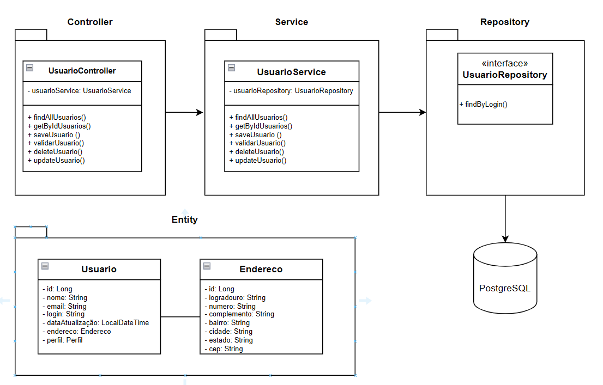

# Postech - Tech Challenge

## 1. Introdução

### Descrição
Implementar uma API Restful com funcionalidades de cadastro, atualização, exclusão e validação de login
de usuários. O sistema deve rodar em um ambiente Docker, com estrutura utilizando o Spring Boot. 
O sistema deve armazenar informação de usuários, com os seguintes campos obrigatórios: nome, email, login, senha e 
data da última alteração. Deve ser realizado a configuração do ambiente Docker. 
Você deverá criar um Dockerfile para o seu projeto Spring Boot e
configurar o Docker Compose para orquestrar tanto a aplicação quanto o banco de
dados relacional.

### Objetivo
Colocar em prática os conceitos explorados na fase 1 do curso postech da Fiap em Arquitetura Java, por meio do desenvolvimento de um backend completo utilizando Spring Boot
e Docker Compose.

## 2. Arquitetura do Sistema

### Descrição da Arquitetura
A arquitetura do sistema é baseada em uma API RESTful, dividida em quatro 
camadas: (i) Controller que é responsável com a comunicação externa da API; 
(ii) Service que encapsula as regras de negócio; (iii) Entity responsável 
pela organização das entidades do sistema; e (iv) Repository que é responsável 
com a comunicação com o banco de dados relacional (PostgreSQL). A API é construída 
utilizando o framework Spring Boot 3.4.4, Maven e Linguagem Java 21. 
Também foram usadas as seguintes dependências: Spring Web, Spring Data JPA, 
PostgreSQL Driver, Validation.

### Diagrama da Arquitetura



## 3. Descrição dos Endpoints da API

### Tabela de Endpoints
<table>
    <thead>
        <tr>
            <th>Endpoint</th>
            <th>Método</th>
            <th>Descrição</th>
        </tr>
    </thead>
    <tbody>
        <tr>
            <td>/api/v1/usuarios</td>
            <td>POST</td>
            <td>Criar um novo usuário</td>
        </tr>
        <tr>
            <td>/api/v1/usuarios/{id}</td>
            <td>GET</td>
            <td>Buscar um usuário pelo ID</td>
        </tr>
        <tr>
            <td>/api/v1/usuarios/{id}</td>
            <td>PUT</td>
            <td>Atualizar um usuário existente</td>
        </tr>
        <tr>
            <td>/api/v1/usuarios/{id}</td>
            <td>DELETE</td>
            <td>Deletar um usuário pelo ID</td>
        </tr>
        <tr>
            <td>/api/v1/usuarios/login</td>
            <td>POST</td>
            <td>Realizar login de um usuário</td>
        </tr>
    </tbody>
</table>

### Acessando a documentação da API
A documentação da api pode ser acessada por meio do seguinte link:
[swagger-ui](http://localhost:8080/swagger-ui/index.html)

### Exemplos de requisição e resposta

* #### GET Listar usuários:
```text
  GET /api/v1/usuarios?page=0\&size=10  
  Status code: 200 \- Successful  
  [  
    {  
      "id": 9007199254740991,  
      "nome": "string",  
      "email": "string",  
      "dataAtualizacao": "string"  
      "endereco": "string",
      "perfil": "PROPRIETARIO | CLIENTE"
    }  
  ]
```
* #### Buscar usuário por ID
```text
  Request: GET /api/v1/usuarios/{id}  
  Response:  
  Status code: 200 \- Successful  
  {  
    "id": 9007199254740991,  
    "nome": "string",  
    "email": "string",  
    "dataAtualizacao": "string"  
    "endereco": "string",
    "perfil": "PROPRIETARIO | CLIENTE"
  }
```
* #### Buscar usuário por ID Inexistente
```text
  Request: GET /api/v1/usuarios/999  
  Response:  
  Status code: 404 \- Not Found  
  {  
      "message": "Usuário não encontrado",  
      "status": 404  
  }
```
* #### Salvar Usuário Proprietário
```text
  Request: POST /api/v1/usuarios  
  {  
      "nome":"string",  
      "email":"string",  
      "login":"string",  
      "senha":"string"  
      "endereco": {
        "logradouro": "string",
        "numero": "string",
        "complemento": "string",
        "bairro": "string",
        "cidade": "string",
        "estado": "string",
        "cep": "string"
      },
     "perfil": "PROPRIETARIO | CLIENTE"
   }
```
* #### Salvar Usuário Cliente
```text
  Request: POST /api/v1/usuarios  
  {  
      "nome":"string",  
      "email":"string",  
      "login":"string",  
      "senha":"string"  
      "endereco": {
        "logradouro": "string",
        "numero": "string",
        "complemento": "string",
        "bairro": "string",
        "cidade": "string",
        "estado": "string",
        "cep": "string"
      },
     "perfil": "CLIENTE"
   }
```
* #### Salvar usuário já existente
```text
  Request: POST /api/v1/usuarios  
  {  
      "nome":"string",  
      "email":"string",  
      "login":"string",  
      "senha":"string"  
      "endereco": {
        "logradouro": "string",
        "numero": "string",
        "complemento": "string",
        "bairro": "string",
        "cidade": "string",
        "estado": "string",
        "cep": "string"
      },
      "perfil": "PROPRIETARIO | CLIENTE"
  }
  Response:  
  Status code: 409 \- Conflict  
  {  
    "message": "Email ou login já cadastrados",  
    "status": 409  
  }
```
* #### Salvar usuário com perfil incorreto
```text
  Request: POST /api/v1/usuarios  
  {  
      "nome":"string",  
      "email":"string",  
      "login":"string",  
      "senha":"string"  
      "endereco": {
        "logradouro": "string",
        "numero": "string",
        "complemento": "string",
        "bairro": "string",
        "cidade": "string",
        "estado": "string",
        "cep": "string"
      },
      "perfil": "ADMIN"
  }
  Response:  
  Status code: 409 \- Conflict  
  {  
    "message": "Nome de perfil incorreto",  
    "status": 409  
  }
```
* #### Realizar login
```text
  Request: POST /api/v1/usuarios/login  
  {  
      "login":"string",  
      "senha":"string"  
  }  
  Response:  
  Status code: 202 \- Accepted
```
* #### Realizar login senha inválida
```text
  Request: POST /api/v1/usuarios/login  
  {  
      "login":"string",  
      "senha":"string"  
  }  
  Response:  
  Status code: 401 \- Unauthorized  
  {  
      "message": "Senha inválida",  
      "status": 401  
  }
```
* #### Atualizar usuário
```text
  Request: PUT /api/v1/usuarios/{id}  
  {  
      "nome":"string",  
      "email":"string",  
      "login":"string",  
      "senha":"string"  
  }  
  Response:  
  Status code: 204 \- No Content
```
* #### Excluir usuário
```text
  Request: /api/v1/usuarios/{id}  
  Response:  
  Status code: 204 \- No Content
```

## 4. Configuração do Projeto

### Docker-Compose 
Foi criado o seguinte docker-compose para orquestar a aplicação. 
Pode ser executado o comando para criar os containers:

```text
docker-compose up --build
```
```yaml
version: '3.8'

services:
  app:
    build: .
    image: app-user:1.0
    depends_on:
      db:
        condition: service_healthy
    environment:
      SPRING_DATASOURCE_URL: jdbc:postgresql://db:5432/db_user
      SPRING_DATASOURCE_USERNAME: postgres
      SPRING_DATASOURCE_PASSWORD: postgres
    ports:
      - "8080:8080"
    networks:
      - app-net

  db:
    image: postgres:15
    restart: always
    environment:
      POSTGRES_DB: db_user
      POSTGRES_USER: postgres
      POSTGRES_PASSWORD: postgres
    ports:
      - "5432:5432"
    volumes:
      - postgres_data:/var/lib/postgresql/data
    networks:
      - app-net
    healthcheck:
      test: [ "CMD-SHELL", "pg_isready -U postgres" ]
      interval: 10s
      timeout: 5s
      retries: 5

volumes:
  postgres_data:

networks:
  app-net:
    driver: bridge
```

### Dockerfile
```dockerfile
# Etapa 1: Construção
FROM maven:3.9.6-amazoncorretto-21 AS build
WORKDIR /app
# Copiar apenas o arquivo pom.xml para baixar as dependências
COPY pom.xml .
RUN mvn dependency:go-offline
# Copiar o código-fonte e construir o projeto
COPY src ./src
RUN mvn clean package -DskipTests

# Etapa 2: Execução
FROM amazoncorretto:21
WORKDIR /app
COPY --from=build app/target/*.jar /app/app.jar
ENTRYPOINT ["java", "-jar", "app.jar"]
```

## 5. Qualidade do Código

### Boas Práticas Utilizadas

#### S - Single Responsibility Principle (SRP)
Cada classe tem uma única responsabilidade, facilitando a 
manutenção e a legibilidade do código.

Cada camada da arquitetura tem uma única responsabilidade:
Controller trata requisições HTTP.
Service contém a lógica de negócio.
Repository lida com o banco de dados.
Entity representa apenas o modelo de dados.

#### O - Open/Closed Principle (OCP):
As classes estão abertas para extensão, mas fechadas para modificação.
Novas funcionalidades podem ser adicionadas sem modificar o código existente.

#### L - Liskov Substitution Principle (LSP):
As subclasses podem ser substituídas por suas superclasses sem alterar o 
comportamento do sistema.

#### I - Interface Segregation Principle (ISP):
As interfaces são específicas e não forçam as classes a implementar métodos

#### D - Dependency Inversion Principle (DIP): 
As classes de alto nível não dependem de classes de baixo nível, ambas 
dependem de abstrações.
A injeção de dependência (@Autowired, construtores) para trabalhar com interfaces, não implementações diretas. Permite trocar implementações com facilidade (ex: simulações em testes).

## 6. Collections para Teste

### Link para a Collection do Postman
[Link Postman](https://github.com/EduardoAguiarDeAraujo/eaa-postech-app-user/blob/main/src/main/resources/Postman/Postech.postman_collection.json)

### Descrição dos Testes Manuais

<table>
    <thead>
        <tr>
            <th>Cenário</th>
            <th>Endpoint</th>
            <th>Método</th>
            <th>Descrição</th>
        </tr>
    </thead>
    <tbody>
        <tr>
            <td>Salvar Usuário Proprietário</td>
            <td>/api/v1/usuarios</td>
            <td>POST</td>
            <td>Salvar novo usuário com perfil de proprietário</td>
        </tr>
        <tr>
            <td>Salvar Usuário Cliente</td>
            <td>/api/v1/usuarios</td>
            <td>POST</td>
            <td>Salvar novo usuário com perfil de Cliente</td>
        </tr>
        <tr>
            <td>Salvar Usuário já Cadastrado</td>
            <td>/api/v1/usuarios</td>
            <td>POST</td>
            <td>Salvar novo usuário com email ou login já cadastrados</td>
        </tr>
        <tr>
            <td>Salvar Usuário com Perfil Incorreto</td>
            <td>/api/v1/usuarios</td>
            <td>POST</td>
            <td>Salvar novo usuário com perfil incorreto</td>
        </tr>
        <tr>
            <td>Login</td>
            <td>/api/v1/usuarios/login</td>
            <td>POST</td>
            <td>Realizar login</td>
        </tr>
        <tr>
            <td>Login Senha Inválida</td>
            <td>/api/v1/usuarios/login</td>
            <td>POST</td>
            <td>Realizar login com senha inválida</td>
        </tr>
        <tr>
            <td>Listar Usuários</td>
            <td>/api/v1/usuarios?page=0&size=10</td>
            <td>GET</td>
            <td>Testar o endpoint de listar usuários</td>
        </tr>
        <tr>
            <td>Buscar Usuário por ID</td>
            <td>/api/v1/usuarios/1</td>
            <td>GET</td>
            <td>Testar a endpoint de buscar usuário por ID</td>
        </tr>
        <tr>
            <td>Buscar Usuário por ID Inexistente</td>
            <td>/api/v1/usuarios/1</td>
            <td>GET</td>
            <td>Testar a endpoint de buscar usuário por ID não cadastrado</td>
        </tr>
        <tr>
            <td>Atualizar Usuário</td>
            <td>/api/v1/usuarios/1</td>
            <td>PUT</td>
            <td>Atualizar usuário</td>
        </tr>
        <tr>
            <td>Excluir Usuário</td>
            <td>/api/v1/usuarios/1</td>
            <td>DELETE</td>
            <td>Excluir usuário</td>
        </tr>
    </tbody>
</table>

## 7. Repositorio do Código

### URL do Repositório
[GitHub](https://github.com/EduardoAguiarDeAraujo/eaa-postech-app-user)